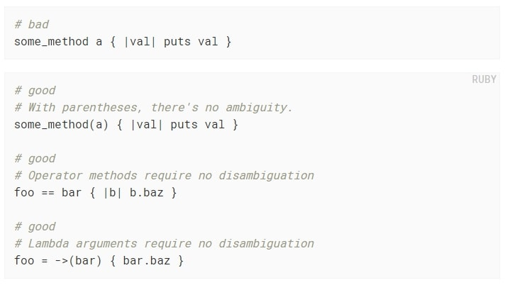
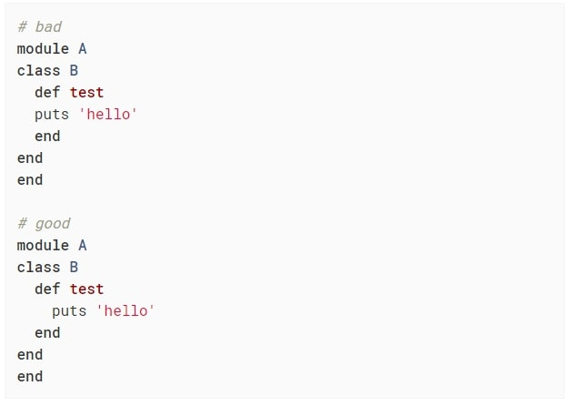

# Ruby Linter Capstone Project


<br />
 
<br> 

## Table of Contents

* [About the Project](#About-The-Project)
* [Getting Started With The Game](#How-To-Use)
* [Built With](#Built-With)
* [Getting started](#Getting-Started)
* [Contributing](#contributing)
* [Author](#Author)


<!-- ABOUT THE PROJECT -->
## About The Project

This requires me to create Ruby linters to further make life easy for me and other programmers. I have created 2 Ruby linters to check

1. AMBIGUITY IN METHOD: This cop checks for ambiguous block association with method when param passed without parentheses.

   

2. LAYOUT STYLE INDENTATION: Bare access modifiers (those not applying to specific methods) should be indented as deep as method definitions, or as deep as the class/module keyword, depending on configuration.

   

## How To Use

The user can easily modify the rules of:

- Line Length
- Block Length
- Class Length
- Indentation

To fit each projects specifics. In order to do it, please go to:

```
$ cd /root-project-folder/
$ cd bin
```

/root-project-folder/bin

Open **_main_** file using the text editor of your preference.

### Built With

* [RUBY](https://ruby-doc.org/)
* [VS-CODE]

<!-- GETTING STARTED -->
## Getting Started

Clone or fork the repo <https://github.com/adewaleK/Ruby_Linter_Capstone.git> to get a copy and explore the content of the project.


<!-- CONTRIBUTING -->
## Contributing

Contributions are what make the open source community such an amazing place to be learn, inspire, and create. Any contributions you make are **greatly appreciated**.

1. Fork the Project
2. Create your Feature Branch (`git checkout -b [Branch-name]`)
3. Commit your Changes (`git commit -m '[Commit-message]'`)
4. Push to the Branch (`git push origin [Branch-name]`)
5. Open a Pull Request

## Author

**Adewale kamilu A**  
* Github: [@githubhandle](https://github.com/adewaleK)
* Twitter: [@twitterhandle](https://twitter.com/twitterhandle)
* Linkedin: [linkedin](https://linkedin.com/linkedinhandle)
* Email: [Email](devkamilnaija@gmail.com)
